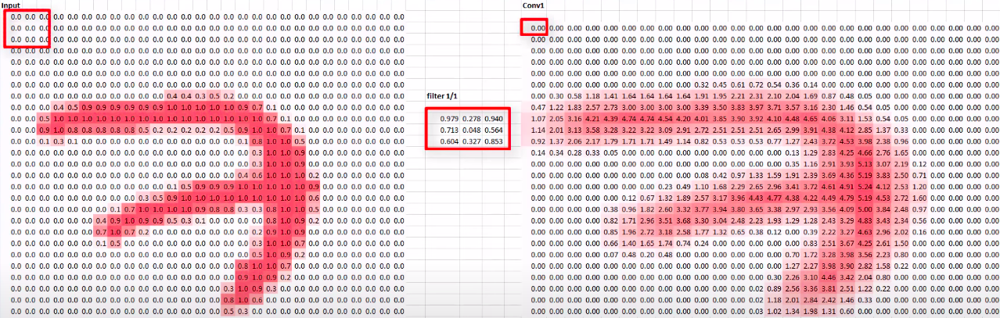
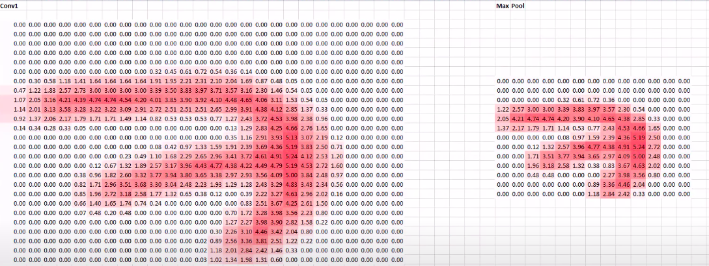

# AI Pool 2021 - Deep Learning - XRAI

Cette journée va être chargé ingenieur. 
À force de vivre sous terre, de noumbreux civils rencontrent des problemes respiratoires. 
Il s'avere que pour certains patients, c'est un cas de pneumoni, c'est une maladie grave et nos medecin n'ont pas le temps d'analyser les resultats de chaques patients. 

Heuresement avec le nouveau framework que l'equipe scientifique vous à présenté, vous êtes aptes à fournir une solution pour aider nos medecins. 

Uttilisez la librairie _Pytorch_ pour créer un model identifiants les cas de pneumoni depuis des photos X-Ray. 

Contrairement à la demonstration faite par l'equipe scientifique, vous devez charger vous meme le dataset. 
Pour cela l'equipe scientifique vous fournit un outil qui vous sera utile: _h5py_

Pour maximiser votre accuracy l'equipe scientifique vous invite à implementer des Convolutions et du Pooling dans votre reseau neuronal. 
N'ayez crainte, ils vous ont redigé un manuel sur les reseaux de neurones convolutifs.

## Manuel Convolutional Neural Network
 
 L'objectif des convolutions est d'apprendre à detecter des patterns spécifiques sur le contenu d'une image.
 Par exemple detecter les yeux sur des portrait, ou encore le museau d'un chien etc.
 
 Pour cela on applique un filtre à l'image donné en intput, c'est notre convolution.
 Voyez le filtre comme une simple matrice ou l'on choisis le nombre de lignes et colonnes. 
 L'uttilisateur est libre de choisir le nombre de filtres par convolutions. 
 
 Prenons en exemple un filtre de taille (3\*3). 
 Quand le layer convolutif recevra une image en input, il appliquera son filtre à chaque set de 3\*3 pixels. 
 Pour chaque set de 3\*3 pixel l'output resultant sera le produit scalaire du filtre par le set de pixels. 
 
 
 L'output final sera alors l'input du prochain layer qui repetra le meme procédé.
.
 Et le pooling dans tout ça ?
 
L'operation de pooling s'effectue typiqement apres  chaque layer convolutif. 
Il permet de reduire de cout de calcule et d'eviter l'overfeeting en reduisant le dimensions de la data donnée en input.

Pour cela on definit la taille du filtre (dans cette exemple 2\*2) ainsi que du stride qui represente de combient de pixel notre filtre va se deplacer apres chaque operations (dans cette exemple 2). 
Le filtre prendra donc en input un set de 2\*2 pixels (qui corresepond à sa taille) et donnera en output la valeur maximal présenté dans ce cette. 
Par exemple pour une matrice contenant `[[0, 1.9],[3.2, 1.6]]` l'output sera `3.2`. 

Les convolutions liés aux pooling seront tres utils dans votre cas.
En ajoutant des couches de convolution avant vos couches dense, l'information fournie aux dense layers est bien plus ciblée, et potentiellement plus précise.

## Consignes:

- Sauvegarder la dataset dans un fichier `.hdf5`
- Construisez un model permetant d'identifié les patient atteind d'une pneumonie avec une accuracy minimal de 75%.
- Afficher un graph de l'evolution de votre loss
- Afficher un graph de l'evolution de votre accuracy

Une fois cela fait, soumetez votre code (Submit/) sur la plateforme.

**Useful links:**
- Dataset :https://www.kaggle.com/paultimothymooney/chest-xray-pneumonia
- Convolutional Neural Networks (CNNs) explained: https://www.youtube.com/watch?v=YRhxdVk_sIs
- Max Pooling in Convolutional Neural Networks explained: https://www.youtube.com/watch?v=ZjM_XQa5s6s
